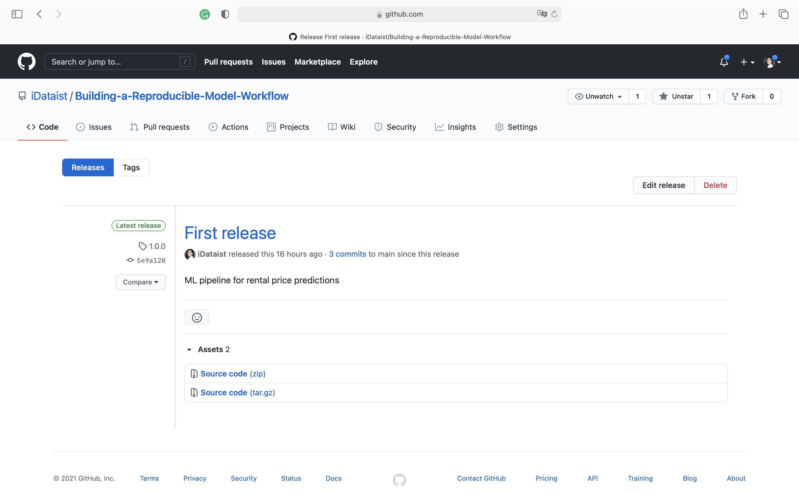

# Build an ML Pipeline for Short-Term Rental Prices in NYC
## Project Overview
A property management company rents rooms and properties for short periods of  time on various rental platforms. I built an end-to-end pipeline to help the company estimate the typical price for a given property based on the price of similar properties. New data arrives in bulk every week. The end-to-end pipeline enables the model retraining with the same cadence. 

## Project steps
### Create environment
Make sure to have conda installed and ready, then create a new environment using the ``environment.yml``
file provided in the root of the repository and activate it:

```bash
> conda env create -f environment.yml
> conda activate nyc_airbnb_dev
```

### Get API key for Weights and Biases
Make sure to login to Weights & Biases. Get your API key from W&B by going to 
[https://wandb.ai/authorize](https://wandb.ai/authorize) and click on the + icon (copy to clipboard), 
then paste your key into this command:

```bash
> wandb login [your API key]
```

You should see a message similar to:
```
wandb: Appending key for api.wandb.ai to your netrc file: /home/[your username]/.netrc
```

### Cookie cutter
Run the cookiecutter and enter the required information, and a new component will be created including the `conda.yml` file, the `MLproject` file as well as the script. 
For example:

```bash
> cookiecutter cookie-mlflow-step -o src

step_name [step_name]: basic_cleaning
script_name [run.py]: run.py
job_type [my_step]: basic_cleaning
short_description [My step]: This steps cleans the data
long_description [An example of a step using MLflow and Weights & Biases]: Performs basic cleaning on the data and save the results in Weights & Biases
parameters [parameter1,parameter2]: parameter1,parameter2,parameter3
```

This will create a step called ``basic_cleaning`` under the directory ``src`` with the following structure:

```bash
> ls src/basic_cleaning/
conda.yml  MLproject  run.py
```

You can now modify the script (``run.py``), the conda environment (``conda.yml``) and the project definition 
(``MLproject``) as you please.

The script ``run.py`` will receive the input parameters ``parameter1``, ``parameter2``,
``parameter3`` and it will be called like:

```bash
> mlflow run src/step_name -P parameter1=1 -P parameter2=2 -P parameter3="test"
```

### The configuration
As usual, the parameters controlling the pipeline are defined in the ``config.yaml`` file defined in
the root of the starter kit. Hydra is used to manage this configuration file. This file is only read by the ``main.py`` script (i.e., the pipeline) and its content is available with the ``go`` function in ``main.py`` as the ``config`` dictionary. For example, the name of the project is contained in the ``project_name`` key under the ``main`` section in
the configuration file. It can be accessed from the ``go`` function as ``config["main"]["project_name"]``.

### Running the entire pipeline or just a selection of steps
In order to run the pipeline, you can execute:

```bash
>  mlflow run .
```
This will run the entire pipeline.

To run selected steps of the pipeline, you can use the `steps` parameter on the command line:

```bash
mlflow run . -P steps=download

mlflow run . -P steps=download,basic_cleaning
```
You can override any other parameter in the configuration file using the Hydra syntax, by
providing it as a ``hydra_options`` parameter. For example, say that we want to set the parameter
modeling -> random_forest -> n_estimators to 10 and etl->min_price to 50:

```bash
mlflow run . \
  -P steps=download,basic_cleaning \
  -P hydra_options="modeling.random_forest.n_estimators=10 etl.min_price=50"

mlflow run . \
  -P steps=train_random_forest \
  -P hydra_options="modeling.random_forest.max_depth=10,50,100 modeling.random_forest.n_estimators=100,200,500 -m"
```

### Visualize the pipeline
You can now go to W&B, go the Artifacts section, select the model export artifact then click on the
``Graph view`` tab. You will see a representation of your pipeline.

### Release the pipeline
First copy the best hyper parameters you found in your ``configuration.yml`` so they become the
default values. Then, go to your repository on GitHub and make a release. 
If you need a refresher, here are some [instructions](https://docs.github.com/en/github/administering-a-repository/managing-releases-in-a-repository#creating-a-release)
on how to release on GitHub.

Call the release ``1.0.0``:



If you find problems in the release, fix them and then make a new release like ``1.0.1``, ``1.0.2``
and so on.

### Train the model on a new data sample

Let's now test that we can run the release using ``mlflow`` without any other pre-requisite. We will
train the model on a new sample of data that our company received (``sample2.csv``):

```bash
> mlflow run https://github.com/iDataist/Building-a-Reproducible-Model-Workflow \
             -v 1.0.0 \
             -P hydra_options="etl.sample='sample2.csv'"
```

**_NOTE_**: the file ``sample2.csv`` contains more data than ``sample1.csv`` so the training will
            be a little slower.

### In case of errors
If there are errors in the `conda.yml` file, you might end up with an environment for the pipeline or one of the components that is corrupted. Most of the time `mlflow` realizes that and creates a new one every time you try
to fix the problem. However, sometimes this does not happen, especially if the problem was in the `pip` dependencies.
In that case, you might want to clean up all conda environments created by `mlflow` and try again. In order to do so,
you can get a list of the environments you are about to remove by executing:

```
> conda info --envs | grep mlflow | cut -f1 -d" "
```

If you are ok with that list, execute this command to clean them up:

**_NOTE_**: this will remove *ALL* the environments with a name starting with `mlflow`. Use at your own risk

```
> for e in $(conda info --envs | grep mlflow | cut -f1 -d" "); do conda uninstall --name $e --all -y;done
```

This will iterate over all the environments created by `mlflow` and remove them.